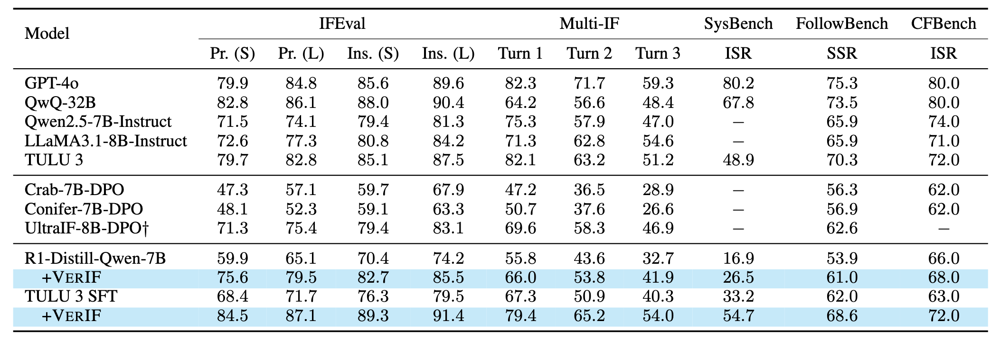
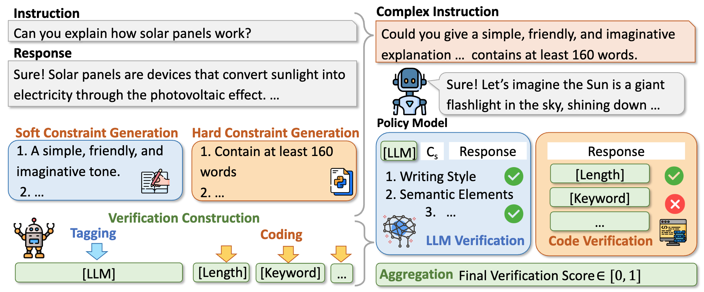

# VerIF: Verification Engineering for RL in Instruction Following

<!-- [](https://huggingface.co/THU-KEG/TULU3-VerIF)  [](https://huggingface.co/datasets/THU-KEG/VerInstruct)  [](https://huggingface.co/THU-KEG/IF-Verifier-7B) -->

<div align="center">

  <a href="https://huggingface.co/THU-KEG/TULU3-VerIF">
    
  </a>
  <a href="https://huggingface.co/datasets/THU-KEG/VerInstruct">
    
  </a>
  <a href="https://huggingface.co/THU-KEG/IF-Verifier-7B">
    
  </a>
  <a href="https://arxiv.org/abs/2506.09942">
    
  </a>

</div>


---

## Introduction

[**VerIF**](https://arxiv.org/abs/2506.09942) is a practical and efficient method for **verification in instruction-following reinforcement learning**. Built on the idea of *Reinforcement Learning with Verifiable Rewards (RLVR)*, VerIF integrates **rule-based code checks** with **LLM-based reasoning verification** (e.g., QwQ-32B) to provide accurate and scalable reward signals.

To support this method, we construct a high-quality dataset, **VerInstruct**, with ~22,000 instruction-following instances paired with verification signals. Models trained with VerIF not only achieve **state-of-the-art performance** on several benchmarks across models at similar scale but also maintain their general capabilities.

### 🔥 Results



*RL with VerIF significantly improves instruction-following performance across benchmarks.*

### Method
<p align="center">

</p>

*VerIF integrates **rule-based code checks** with **LLM-based reasoning verification** (e.g., QwQ-32B) to provide accurate and scalable reward signals.*

---


## Data & Trained Models

- [VerInstruct (24k instruction-following examples with verifiable signals)](https://huggingface.co/datasets/THU-KEG/VerInstruct)
- [TULU3-VerIF](https://huggingface.co/THU-KEG/TULU3-VerIF), based on Llama-3.1-Tulu-3-8B-SFT
- [R1-Distill-Qwen-7B-VerIF](https://huggingface.co/THU-KEG/R1-Distill-Qwen-7B-VerIF), based on DeepSeek-R1-R1-Distill-Qwen-7B

---

## Training Guide

This repo is forked from [verl](https://github.com/volcengine/verl). We sincerely thank the authors for their excellent framework. We introduce two key adjustments:

1. **Efficient Local Reward Server**:  
   We provide a `local_server` version of the reward function for better efficiency. We recommend running it inside a **sandboxed Docker** environment to avoid potential security issues. You may also deploy your own remote server.

2. **Batch Reward Collection**:  
   We modified `./verl/workers/reward_manager/naive.py` to support **batched reward calculation**, which is more efficient than the original loop-based implementation. We do not modify other parts of the repo.

---

## Quick Start (RL Using VerIF)

Please refer to the original [verl documentation](https://github.com/volcengine/verl) for environment setup.

### Step 1: Preprocess Data  
Download data from [here](https://huggingface.co/datasets/THU-KEG/VerInstruct). Use `./examples/data_preprocess/if_prompts.py` to preprocess VerInstruct.  
> Make sure to add the import path for `./verl/utils/reward_score/local_server` at the top of each function.

### Step 2: Setup the Verifier Model  
For **soft constraint verification**, use an LLM-based verifier. You may:
- Use our own trained [verifier](https://huggingface.co/THU-KEG/IF-Verifier-7B) based on R1-Distilled-Qwen-7B
- Use **QwQ-32B** as the verifier

We suggest using **SGLang** or **vLLM** for deployment.  
Then modify `./verl/utils/reward_score/local_server/llm_call.py` with your API endpoint and model name.

### Step 3: Start Training  
Use the provided training scripts:

- `./examples/grpo_trainer/run_qwen2-7b_verif.sh`  
- `./examples/grpo_trainer/run_tulu3-8b_verif.sh`

These use DeepSeek-RL-Distilled-Qwen-7B and TULU 3 SFT as base models.  
Update paths to point to your model checkpoint if needed.

---

## Acknowledgments

We thank the [**verl**](https://github.com/volcengine/verl) team for their open-source framework, and the [**Crab**](https://github.com/THU-KEG/Crab) team for their open-sourced original data.


## Citations
If this repo helps, please kindly cite us:
```
@misc{peng2025verif,
      title={VerIF: Verification Engineering for Reinforcement Learning in Instruction Following}, 
      author={Hao Peng and Yunjia Qi and Xiaozhi Wang and Bin Xu and Lei Hou and Juanzi Li},
      year={2025},
      eprint={2506.09942},
      archivePrefix={arXiv},
      primaryClass={cs.CL},
      url={https://arxiv.org/abs/2506.09942}, 
}
```
